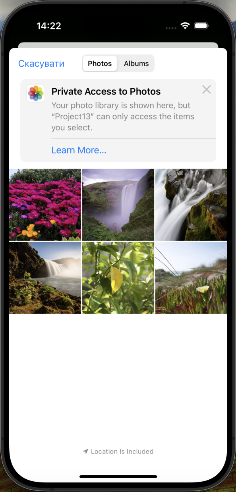

Here is the rewritten README file:

# Project13

Project13 is an iPhone app that allows users to add and manage their own photos.

## Table of Contents

* [Features](#features)
* [Screenshots](#screenshots)
* [Requirements](#requirements)
* [Usage](#usage)
* [Code Overview](#code-overview)

## Features

* Add and manage photos with captions
* View and edit existing photos
* Delete photos
* Save and load photos from the device's document directory

## Screenshots

  
   
  <em>Add New Picture Screen</em>

  
   
  <em>Picture List Screen</em>

  
   
  <em>Select Actions Screen</em>

  
   
  <em>Picture Details Screen</em>

## Requirements

* iOS 12.0+
* Xcode 12.0+
* Swift 5.0+

## Usage

1. Launch the app.
2. Tap the "Add" button to add a new photo.
3. Choose a photo from your device's camera roll or take a new one.
4. Add a caption to the photo.
5. Tap the "Save" button to save the photo.
6. View and edit your saved photos by tapping on the "Pictures" tab.
7. Delete photos by tapping on the "Delete" button.
8. Save and load your photos from the device's document directory.

## Code Overview

### ViewController

* Manages the list of pictures and displays them in a table view.
* Handles user interactions, such as adding, editing, or deleting pictures.
* Includes a feature to save and load pictures from the device's document directory.

### DetailViewController

* Displays the details of a selected picture, including its name and image.
* Includes a feature to share the picture's information. 
